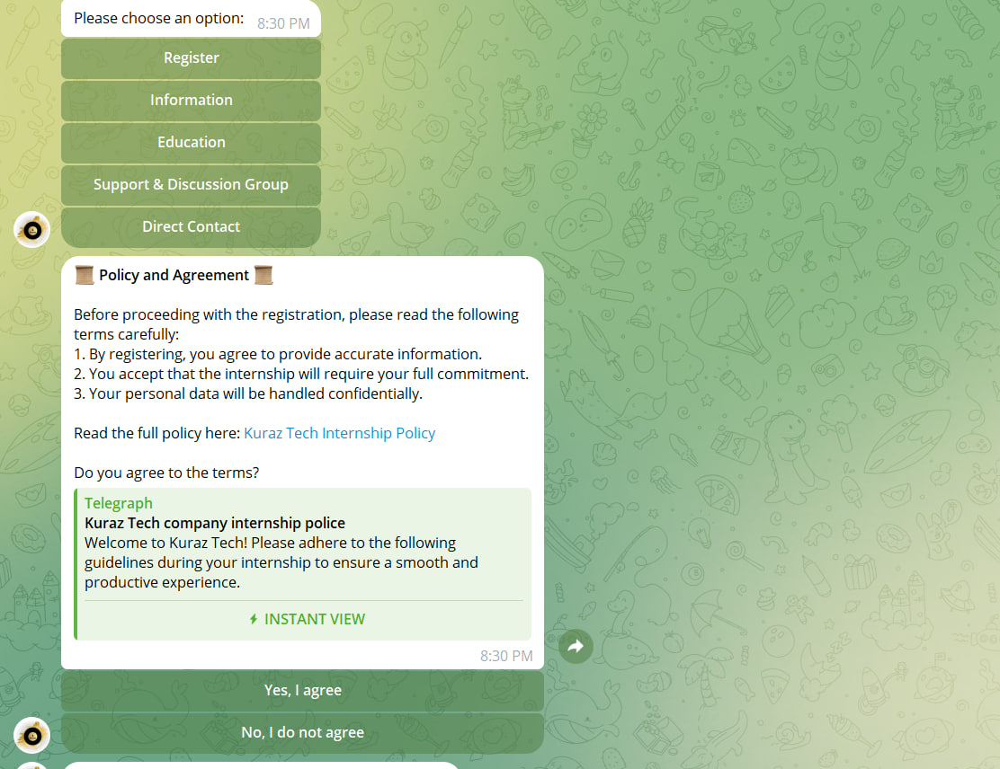

# Kuraz Tech Bot - Telegram Bot for Internship Registration

<!-- Add a logo or banner image if available -->

## Table of Contents
- [Overview](#overview)
- [Features](#features)
- [Tech Stack](#tech-stack)
- [Getting Started](#getting-started)
  - [Prerequisites](#prerequisites)
  - [Installation](#installation)
  - [Usage](#usage)
- [Project Structure](#project-structure)
- [How It Works](#how-it-works)
  
- [Contributing](#contributing)
- [License](#license)
- [Contact](#contact)

## Overview
Kuraz Tech Bot is a Telegram Bot built using Node.js and the `node-telegram-bot-api` library to streamline the registration process for the Kuraze Internship program. It offers a seamless experience for both users and admins, allowing users to register and admins to manage the registrations effectively.
## 📸 User Registration look like 


## 📸 student before Registration 

## 📸 The admin side of the bot look like 

## 📸 when student get approval


## 📸 the other information display like this 


---

## Features

### User Interaction:
- Simple registration process through Telegram.
- Collects user details such as full name, GitHub and LinkedIn profiles, phone number, and email.
- Provides informational links to the Kuraze Internship resources.

### Admin Interaction:
- Allows admins to review, approve, or reject registration requests.
- Sends notifications to users about the status of their application.

### Messaging & Support:
- Offers direct contact options for further inquiries.
- Links to support groups and official channels.

## Tech Stack
- **Node.js**: The runtime environment used for building the bot.
- **node-telegram-bot-api**: A library to interact with the Telegram Bot API.
- **dotenv**: To manage environment variables securely.
- **Telegram Bot API**: For handling bot interactions and user messaging.

## Getting Started

### Prerequisites
- **Node.js**: Ensure you have Node.js installed. [Download Node.js](https://nodejs.org/)
- **Telegram Bot Token**: Create a Telegram bot using BotFather and obtain the token.
## Installation

1. **Clone the repository:**

   ```bash
   git clone https://github.com/Yabe12/kuraz-project-.git
   cd kuraz-tech-bot
   ```

2. **Install dependencies:**
  ```bash
  npm install
   ```

3. **Set up environment variables:**

   - Create a `.env` file in the root directory.
   - Add your bot token and admin chat ID:

   ```env
   STUDENT_BOT_TOKEN=your_bot_token
   ADMIN_ID=your_admin_chat_id
   ```
4. **Run the bot:**
```bash
 node studentBot.js
```
## Usage

### User Commands:
- `/start`: Begins the registration process.
- Navigate through the bot's menu to access information, register, or contact support.

### Admin Commands:
- Review and manage pending registrations directly from the Telegram chat.
- Approve or reject registrations using the provided inline buttons.

## Project Structure
- `adminChatId.js`: Handles admin-related functionalities and interactions.
- `studentBot.js`: Main bot logic for handling user commands and registration processes.
- `.env`: Contains environment variables for sensitive data.
- `package.json`: Project metadata and dependencies.

## How It Works

### Initialization:
- The bot is initialized using the token provided in the `.env` file and uses polling to listen for updates.

### Registration Process:
- Users are guided through a series of prompts to complete their registration.
- The collected data is sent to the admin for review.

### Admin Review:
- Admins receive the registration request with options to approve or reject.
- Notifications are sent to users based on the admin's decision.

## Contributing

We welcome contributions! Please follow these steps:

1. **Fork the repository.**
2. **Create a new branch:**
   ```bash
   git checkout -b feature-branch
   ```
3. **Make your changes and commit:**
   ```bash
   git commit -m 'Add new feature'
   ```
4. **Push to the branch:**
   ```bash
   git push origin feature-branch
   ```
5. **Open a pull request.**
## License


This project is licensed under the MIT License - see the [LICENSE](../LICENSE.md) file for details.

## Contact

For any inquiries or support, please reach out to me at [yeabsirabehailu92@gmail.com](mailto:yeabsirabehailu92@gmail.com) or connect with me on [LinkedIn](https://www.linkedin.com/in/yeabsira-behailu-19504b285/).


